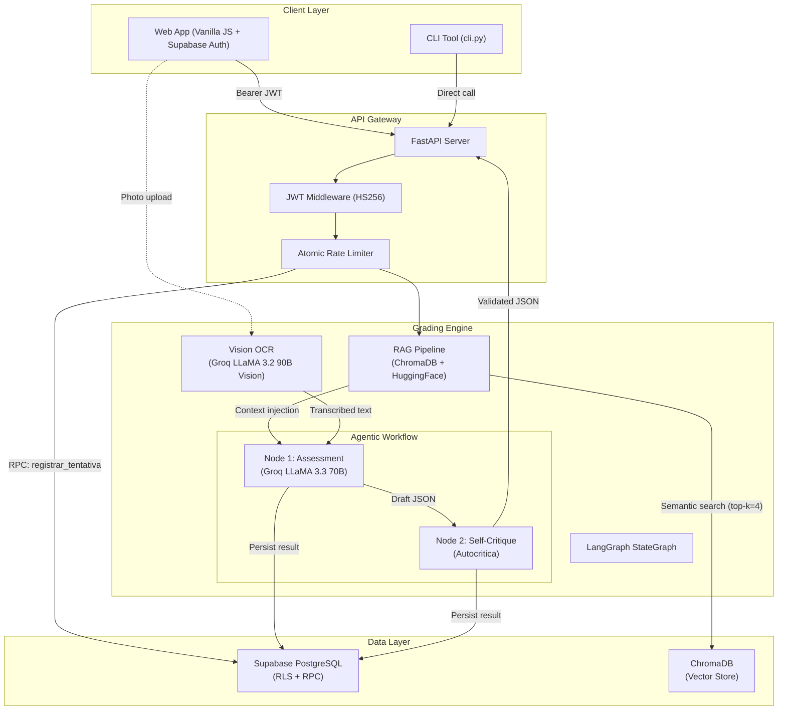

<p align="center">  </p> <h1 align="center">Reda1000</h1> <p align="center"> <b>AI-powered ENEM essay grading engine with RAG and adversarial self-critique.</b><br/> Scores across the 5 official competencies, textual citations, and specific feedback, not generic. </p> <p align="center">     </p> <p align="center"> <a href="#features">Features</a> • <a href="#architecture">Architecture</a> • <a href="#getting-started">Getting Started</a> • <a href="#api-reference">API</a> • <a href="#security">Security</a> </p>
<p align="center">         </p>


## Why Reda1000 exists

Manual grading of ENEM essays is slow and inconsistent between graders. Generic AI tools give vague scores ("improve your text") with no grounding in the official INEP criteria. Reda1000 solves this with a **two-stage pipeline**: one agent produces the grading, a second agent audits that grading against known failure modes (generic feedback, unsupported scores, incomplete C5) before releasing the result.

## Features

- ✅ Grading across the 5 official ENEM competencies, with citations from the student's text
- ✅ Adversarial self-critique: a second AI node audits and rewrites the grading before delivery
- ✅ RAG over the official INEP criteria (local embeddings, zero API cost)
- ✅ Multimodal OCR for photographed handwritten essays
- ✅ Atomic rate limiting (no race conditions) via PostgreSQL RPC
- ✅ Per-user data isolation via Row-Level Security in Supabase
- ✅ One-command deployment via Docker Compose

## Architecture



### Grading pipeline in detail

The core of the system is a **two-node LangGraph StateGraph** that guarantees grading quality through adversarial reflection:

```
START --> [Assessment Node] --> [Self-Critique Node] --> END
```

1. **Assessment Node** receives the student's essay, the INEP criteria retrieved via RAG, and strict system prompts. It produces a structured JSON with scores across the 5 competencies, justifications, and text citations.

2. **Self-Critique Node (Autocritica)** acts as an adversarial reviewer, checking the draft against:
   - `[F1]` Missing verbatim text evidence for any critique
   - `[F2]` Generic or vague recommendations ("improve your text")
   - `[F3]` Score/feedback misalignment (e.g., score 80 with praise-only feedback)
   - `[F5]` Missing breakdown of C5 intervention elements (Agent, Action, Means, Effect, Detail)

   If any failure is detected, the node rewrites the affected sections before producing the final output.

---

## Engineering decisions

### 1. Atomic rate limiting via PostgreSQL RPC

Traditional rate limiters suffer from **TOCTOU (Time-of-Check to Time-of-Use)** race conditions: concurrent requests can all read "0 essays today" and bypass the limit simultaneously.

Reda1000 solves this at the database level with a custom PL/pgSQL function:

```sql
-- Atomic INSERT ... ON CONFLICT DO UPDATE with row-level lock
CREATE FUNCTION registrar_tentativa_redacao(p_chave TEXT, p_limite INT)
RETURNS BOOLEAN AS $$
  -- Returns TRUE if under limit (attempt registered)
  -- Returns FALSE if limit reached (attempt rejected)
  -- All under a single transaction with row-level lock
$$ LANGUAGE plpgsql;
```

This function is invoked via Supabase RPC, ensuring that even under high concurrency, **no user can exceed their daily quota**. The system also enforces a global cost-protection limit (`MAX_CORRECOES_SISTEMA_DIA`) using the same mechanism.

### 2. RAG with local embeddings (zero API cost)

Instead of relying on paid cloud embedding APIs, Reda1000 uses **HuggingFace `all-MiniLM-L6-v2`** running locally inside the container. Official INEP guidelines are chunked, vectorized, and stored in ChromaDB at build time via `scripts/seed.py`. At inference, the student's essay is used as a query to retrieve the top-4 most relevant criteria fragments, injected directly into the prompt as few-shot context.

### 3. Multimodal OCR for handwritten essays

Students often practice on paper. Reda1000 accepts photos of handwritten essays and transcribes them using **Groq LLaMA 3.2 90B Vision**. The OCR pipeline is specifically instructed to:
- Preserve the student's original line breaks and paragraph structure
- **Never auto-correct** spelling or grammar errors (they must be evaluated by the grader)
- Mark illegible sections as `[ilegivel]` rather than guessing

### 4. Structured output enforcement

All LLM calls use Groq's `response_format={"type": "json_object"}` to guarantee valid JSON output. The response is further validated against required top-level keys (`nota_total`, `notas`) and cleaned of markdown fences before parsing.

---

## Tech Stack

| Layer | Technology | Purpose |
|---|---|---|
| **LLM** | Groq Cloud (LLaMA 3.3 70B Versatile) | Essay grading & self-critique |
| **Vision** | Groq Cloud (LLaMA 3.2 90B Vision) | Handwritten essay OCR |
| **Orchestration** | LangGraph (StateGraph) | Agentic multi-node workflow |
| **RAG** | ChromaDB + HuggingFace Embeddings | Semantic retrieval of INEP criteria |
| **Backend** | FastAPI + Uvicorn | Async REST API |
| **Database** | Supabase (PostgreSQL + RLS + RPC) | Persistence, auth, rate limiting |
| **Auth** | Supabase Auth + PyJWT (HS256) | JWT-based user authentication |
| **Frontend** | Vanilla JS + Supabase JS SDK v2 | SPA with dark-mode UI |
| **Testing** | Pytest + pytest-cov + pytest-mock | Unit & integration tests |
| **CI/CD** | GitHub Actions | Automated testing + Docker build |
| **Container** | Docker + Docker Compose | Production deployment |

## Project Structure

```
reda1000_v1/
├── app/
│   ├── api/
│   │   ├── routes.py          # FastAPI endpoints (/corrigir/texto, /corrigir/foto, /historico)
│   │   └── schemas.py         # Pydantic v2 request/response models
│   ├── auth.py                # JWT verification middleware (Supabase tokens)
│   ├── config.py               # Centralized environment configuration
│   ├── corrector.py            # Core grading orchestrator (facade pattern)
│   ├── database.py             # Supabase client, persistence, atomic rate limiting
│   ├── llm.py                  # LangGraph StateGraph (assessment + self-critique nodes)
│   ├── ocr.py                  # Multimodal vision transcription (handwritten essays)
│   ├── prompts.py               # ENEM-specific system prompts and competency rubrics
│   └── rag.py                  # ChromaDB retrieval pipeline
├── data/
│   └── criteria/                # Official INEP guidelines (Markdown + PDF)
├── frontend/
│   ├── index.html               # Single-page application
│   ├── style.css                # Dark-mode design system (Navy + Gold)
│   └── app.js                   # Client logic, Supabase auth, API integration
├── scripts/
│   ├── seed.py                  # ChromaDB ingestion (PDF-to-Markdown conversion)
│   └── sql/
│       └── rate_limit.sql       # Atomic rate limiter (PL/pgSQL function)
├── tests/
│   ├── conftest.py              # Test fixtures and env setup
│   ├── test_auth.py             # Authentication edge cases (6 scenarios)
│   ├── test_corrector.py        # JSON parsing and validation
│   ├── test_database_rate_limit.py  # Atomic RPC mock tests
│   ├── test_routes.py           # Full API integration tests (12 scenarios)
│   └── test_schemas.py          # Pydantic validation constraints
├── .github/workflows/ci.yml     # GitHub Actions CI pipeline
├── Dockerfile                   # Production container (CPU-optimized PyTorch)
├── docker-compose.yml           # Service orchestration with persistent volumes
├── server.py                    # FastAPI application entrypoint + health check
└── cli.py                       # Interactive terminal tool
```

---

## Getting Started

### Prerequisites

- Python 3.11+
- [Groq API Key](https://console.groq.com) (free tier available)
- [Supabase Project](https://supabase.com) (free tier available)

### 1. Clone & install

```bash
git clone https://github.com/ghcalado/reda1000_v1.git
cd reda1000_v1
python -m venv venv
source venv/bin/activate
pip install -r requirements.txt
```

### 2. Configure environment

```bash
cp .env.example .env
# Edit .env with your credentials:
```

| Variable | Description |
|---|---|
| `GROQ_API_KEY` | Your Groq Cloud API key |
| `SUPABASE_URL` | Supabase project URL |
| `SUPABASE_ANON_KEY` | Supabase public (anon) key |
| `SUPABASE_SERVICE_ROLE_KEY` | Supabase service role key (server-side only) |
| `SUPABASE_JWT_SECRET` | JWT signing secret for token verification |
| `MAX_CORRECOES_USUARIO_DIA` | Max essays per user per day (default: `3`) |
| `MAX_CORRECOES_SISTEMA_DIA` | Global daily limit across all users (default: `50`) |

### 3. Initialize the vector database

```bash
python scripts/seed.py
```

### 4. Apply database migrations

Run the SQL scripts in your Supabase SQL Editor:
- `scripts/sql/rate_limit.sql` (atomic rate limiter function)

### 5. Launch

```bash
# Web server
python server.py

# Or interactive CLI
python cli.py
```

The web interface will be available at `http://localhost:8000`.

### Docker

```bash
docker compose up --build
```

---

## API Reference

All endpoints require a valid Supabase JWT in the `Authorization: Bearer <token>` header.

### `POST /api/v1/corrigir/texto`

Submit a typed essay for grading.

```json
{
  "tema": "The impact of social media on mental health",
  "texto_redacao": "In contemporary society, the influence of..."
}
```

**Response** (`200`): Structured JSON with `nota_total`, per-competency `notas` (C1-C5), justifications, text citations, and study recommendations.

### `POST /api/v1/corrigir/foto`

Submit a photo of a handwritten essay (multipart form data).

| Field | Type | Description |
|---|---|---|
| `tema` | `string` | Essay topic |
| `arquivo` | `file` | Image file (JPG, PNG, WebP, GIF, BMP) |

**Response** (`200`): `texto_reconhecido` (OCR transcription) + full `correcao` JSON.

### `GET /api/v1/historico?limite=10`

Retrieve the authenticated user's past essay corrections.

### `GET /health`

Service health check reporting status of internal subsystems.

---

## Testing

```bash
# Install dev dependencies
pip install -r requirements-dev.txt

# Run full test suite with coverage
pytest --cov=app --cov-report=term-missing
```

The test suite covers:

| Module | Scenarios |
|---|---|
| `test_auth.py` | Valid tokens, missing headers, expired/malformed/invalid tokens (6 cases) |
| `test_corrector.py` | Markdown fence stripping, JSON schema validation |
| `test_database_rate_limit.py` | Atomic RPC calls, rate rejection, fallback handling, global limits |
| `test_routes.py` | Full API integration: 200s, 401s, 422s, 429s, 500 error masking, path traversal (12 cases) |
| `test_schemas.py` | Pydantic validation constraints |

---

## Deployment

### Render / Railway (recommended)

1. Connect your GitHub repository.
2. Select **Docker** as the build environment.
3. Add all environment variables from `.env` to the platform's settings.
4. Deploy. The `Dockerfile` handles everything: dependency installation, vector DB seeding, and server startup.

> **Note**: The Dockerfile pre-installs CPU-only PyTorch (`--index-url https://download.pytorch.org/whl/cpu`) to minimize memory footprint. The application runs comfortably under 512MB RAM.

### Docker Compose (self-hosted)

```bash
docker compose up -d
```

The `docker-compose.yml` includes:
- Persistent volume for ChromaDB data (`chroma_data`)
- Health check configuration
- Automatic `.env` loading

---

## Security

Reda1000 implements multiple layers of production-grade security:

| Threat | Mitigation |
|---|---|
| **Unauthorized access** | Supabase JWT verification (HS256) on every endpoint |
| **Data isolation** | PostgreSQL Row-Level Security (each user sees only their own data) |
| **Rate limit bypass** | Atomic PL/pgSQL function eliminates TOCTOU race conditions |
| **Path traversal** | Filename sanitization on uploads (`re.sub(r"[^a-z0-9.]", "")`) + `..` blocking on static files |
| **Information disclosure** | Raw stack traces never reach the client (sanitized 500 responses) |
| **Container privilege escalation** | Runs as non-root `appuser` (uid 1000) |
| **Secrets exposure** | `.env` excluded via `.gitignore` and `.dockerignore` |

---

## Roadmap

- [ ] Support for other Brazilian entrance exams beyond ENEM (FUVEST, UERJ)
- [ ] Dashboard for historical score progress per user
- [ ] PDF export of gradings
- [ ] Multi-language mode

## Contributing

This is a portfolio project by [Ghabriel Calado]([https://github.com/ghcalado]). Suggestions and issues are welcome — open an [issue](https://github.com/ghcalado/reda1000_v1/issues) describing the problem or idea before submitting a PR.

## License

This project is for educational and portfolio purposes. See [LICENSE](LICENSE) for details.

---

<p align="center">
  <sub>Built with Groq, LangGraph, ChromaDB, Supabase, and FastAPI — by <a href="https://github.com/ghcalado">Ghabriel</a>.</sub>
</p>
